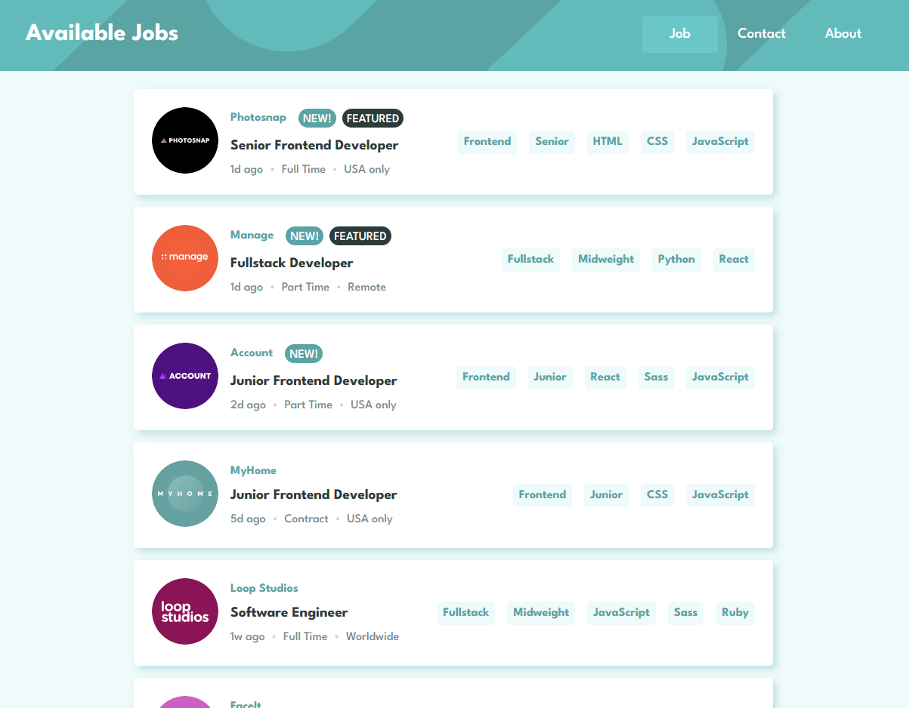

# PT - Available Jobs 

Prueba Técnica desarrollada para resolver los desafios propuesto por NTT DATA Perú

## Tabla de contenido

- [Overview](#overview)
    - [Screenshot](#screenshot)
- [Mi proceso](#mi-proceso)
    - [Construido con](#construido-con)
    - [Estrategia de Optimización](#estrategia-de-optimizacion)
    - [Useful resources](#useful-resources)
- [Autor](#autor)

## Overview

### Screenshot

## Mi proceso

1.- Implementar el consumo de un servicio RESTful para obtener datos de trabajos disponibles, utilizando el servicio HttpClient y la librería RXJS y mostrarlo como lista en un componente.

2.- Implementar la navegación a otros componentes utilizando el patrón de diseño Lazy Loading para mejorar el rendimiento de la aplicación.

3.- Implementar prueba unitaria y de integración para verificar el cumplimiento de la funcionalidad esperada de nuestra aplicación.

### Estrategia de optimizacion

A continuación, menciono algunas estrategias de optimización a implementar para mejorar el rendimiento de nuestra aplicación

1.- Lazy loading: una técnica de optimización aplicada a nivel de módulos para realizar la carga necesaria de nuestros componentes.

const routes: Routes = [{ path: 'pages', loadChildren: () => import('./mages/pages.module').then(m => m.PagesModule) }];

2.- Change Detection: se utiliza para evitar ejecuciones innecesarias al detectar cambios en nuestro componente, mayormente usado en componentes con variables de entrada y el uso del ciclo de vida como ngOnChanges.

3.- Reducir el tamaño del Bundle: uso de herramienta como tree-shaking para eliminar código no utilizado, como dependencias no utilizadas, comunmente utilizado por el empaquetador webpack.

### Construido con

- Angular - Typescript - SCSS
- [API Mocha](https://apimocha.com/)

## Autor

- LinkedIn - [Mark Anthony JC](https://www.linkedin.com/in/mark-anthony-jorge-cerr%C3%B3n-b3202b156/)